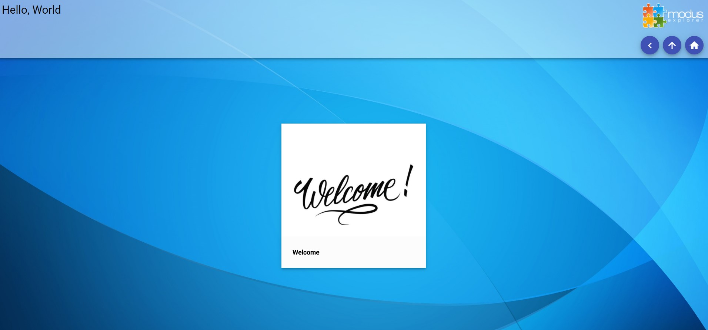

# Modus Explorer - Guida utente <!-- omit in toc -->

- [Prerequisiti](#prerequisiti)
- [Installazione](#installazione)
- [Struttura del repository](#struttura-del-repository)
- [Sviluppo](#sviluppo)
  - [Comandi di avvio](#comandi-di-avvio)
- [Gestione contenuti](#gestione-contenuti)
  - [Overview](#overview)
  - [Schemi](#schemi)
    - [Esempio: Testo localizzato](#esempio-testo-localizzato)
    - [Esempio: Lingua](#esempio-lingua)
    - [Esempio: Array](#esempio-array)
  - [Configurazione globale](#configurazione-globale)
  - [Componenti](#componenti)
    - [Liste a blocchi](#liste-a-blocchi)
    - [Slideshow](#slideshow)
    - [Deepzoom](#deepzoom)
    - [3D](#3d)
    - [Pagine](#pagine)
  - [Fogli di stile](#fogli-di-stile)
- [Produzione](#produzione)
  - [Cartella radice](#cartella-radice)
  - [Deployment](#deployment)

## Prerequisiti

Per poter utilizzare l'applicazione in modalità di sviluppo, è necessario installare i seguenti tool:
- [NodeJS](https://nodejs.org/en/) - L'ambiente di esecuzione di tutti i tool di sviluppo. Installare la versione LTS raccomandata.
- [Git](https://git-scm.com/) - Software di version control. Necessario per reperire il codice sorgente dell'applicazione dal repository online.
- [Visual Studio Code](https://code.visualstudio.com/) (fortemente consigliato) - Visual Studio Code è la IDE gratuita di Microsoft. In alternativa è possibile utilizzare altri editor/IDE di propria scelta, tuttavia, in questa guida si farà riferimento a Visual Studio Code. I concetti rimangono comunque validi qualsiasi sia l'ambiente di sviluppo utilizzato.

Sia Git che NodeJS funzionano da riga di comando. Per quanto riguarda Git è disponibile anche una versione con interfaccia grafica che però non verrà trattata in questo documento.

## Installazione

Il codice sorgente dell'applicazione viene reperito tramite il client Git dal repository online. 

Ogni volta che si vuole create un nuovo progetto Modus Explorer è necessario eseguire questa procedura. Ogni progetto contiene il codice sorgente e tutti i file utilizzati per la generazione dei contenuti. 

Per create un nuovo progetto, aprire un prompt dei comandi e posizionarsi sulla cartella di lavoro desiderata (ad esempio, "Documenti") e lanciare il seguente comando:
```
git clone https://github.com/erbuka/modus-explorer <cartella di destinazione>
```

Si consiglia di usare il nome del progetto stesso per la cartella di destinazione. Se la cartella di destinazione non viene specificata, il sistema utilizza il nome stesso del repository "modus-explorer".

Dopo che l'operazione di clonazione è completata, è necessario installare tutti i pacchetti necessari allo sviluppo dell'applicazione: posizionarsi con il prompt dei comandi nella cartella appena creata e lanciare il seguente comando:
```
npm i
```
A questo punto NodeJS installerà tutti i pacchetti necessari allo sviluppo dentro la cartella "node_modules".

**Attenzione:** Se per qualsiasi motivo si volesse fare una copia manuale del progetto in un'altra cartella, escludere la cartella "node_modules" dalla copia, in quanto contiene centinaia di migliaia di file e **il tempo di copia sarebbe biblico**. E' molto più conveniente invece copiare tutto tranne "node_modules", ed eseguire nuovamente il comando "npm i" nella cartella di destinazione.

## Struttura del repository

Di seguito si riporta l'organizzazione delle cartelle del progetto. Alcune cartelle non saranno presenti immediatamente dopo aver creato il repository in quanto vengono automaticamente create dal sistema nel momento del bisogno.

- **assets/** - Configurazione e contenuti
- **build-dev/** - Build di sviluppo
- **build-prod/** - Build di produzione
- **node_modules/** - Moduli NodeJS
- **scripts/** - Script di automazione
- **src/** - Codice sorgente
  - **scss/** - Fogli di stile
- **templates/** - Template per schede/pagine

## Sviluppo

La modalità sviluppo consente di eseguire l'applicazione in un server web locale e di lavorare sui contenuti in maniera interattiva. Questa modalità richiede l'utilizzo di 2 o più prompt dei comandi aperti contemporaneamente, e quindi si consiglia di utilizzare Visual Studio Code per il terminale/prompt integrato.

### Comandi di avvio

Per avviare il server locale, aprire un prompt dei comandi nella cartella del progetto e lanciare il comando:

```
npm run start:dev-server
```
Questo svolge le seguenti operazioni:
- se si tratta della prima esecuzione, genera un progetto con dei contenuti di esempio.
- apre un server web locale in ascolto sulla porta 8080
- avvia una serie di comandi secondari che ricompilano alcune parti dell'applicazione (ad esempio, i templates) se queste vengono modificate dall'utente.

Per compilare il codice sorgente vero e proprio, aprire un altro prompt e lanciare il comando:

```
npm start
```
In questo modo si avvia il processo di compilazione. Al primo avvio in assoluto, potrebbero volerci alcuni minuti dato che il sistema deve compilare tutte le dipendenze.

**NB**: entrambe i comandi sono di tipo "watch", ossia dei processi attivi in attesa di modifiche ai file locali all'applicazione. Quando avviene una modifica, l'applicazione viene ricompilata. E' quindi necessario che i prompt dei comandi rimangano aperti durante la fase di sviluppo

A questo punto è possibile navigare tramite browser all'indirizzo http://localhost:8080/ e se la procedura è stata eseguita correttamente si dovrebbe visualizzare la seguente schermata:



## Gestione contenuti

### Overview

Il sistema di gestione dei contenuti Modus Explorer è basato su file e cartelle. Tutti i file relativi ai contenuti si trovano sotto la cartella "assets", dove l'utente crea e organizza una gerarchia di cartelle che rappresentano le pagine e sezioni dell'applicazione.

Il percorso di ogni cartella definisce anche l'URI della pagina ad esso associata. Ad esempio, se si crea un componente Slideshow in "assets/slideshow", questo percorso rappresenta anche l'indirizzo relativo della pagina nel browser (ad esempio, nel server web locale, "http://localhost:8080/assets/slideshow").

Per ogni cartella può quindi essere definito un componente tramite un file di configurazione di nome "item.json". Al momento, i tipi di componente supportati in Modus Explorer sono i seguenti:
- Lista a blocchi - una lista di link ad altre pagine organizzata in blocchi con immagine e titolo
- Slideshow - Insieme di slide (immagini, video, 3D, deepzoom, etc.)
- Deepzoom - Visualizzazione multi-layer di immagini ad alta risoluzione
- 3D - Visualizzatore scene 3D
- Pagine - Pagina dinamica con contenuti arbitrari definita tramite templates

A parte il 3D per il quale è incluso un editor, i file "item.json" relativi agli altri componenti devono essere scritti a mano e devono seguire un determinato schema a seconda del componente. Per la sintassi di base del formato JSON, si rimanda al [sito ufficiale](https://www.json.org/json-en.html).

### Schemi

Lo schema definisce la struttura di un determinato file JSON, i campi che può o non può contenere, e il tipo di ogni campo. In questa sezione si riportano alcuni schemi JSON ricorrenti nelle sezioni successive.

#### Esempio: Testo localizzato

Essendo Modus Explorer un'applicazione multi-lingua è necessario avere un modo di specificare i contenuti testuali in più lingue. Quindi negli schemi dei vari componenti i testi devono seguire lo schema "LocalizedText". 

Schema:
```typescript
export type LocalizedText = string | { [locale: string]: string }
```

In questo schema, seppur molto breve ci sono vari concetti:
1. Ci sono dei tipo fondamentali. Il tipo "string" rappresenta una sequenza di caratteri definita tra doppi apici (es. "Hello, World!"). Gli altri tipi fondamentali includono numeri ("number"), valori vero/falso ("boolean"), oggetti (definiti tra parentesi graffe), array (definiti tra parenesi quadre) e valori nulli ("null")
2. Alternative: Il carattere "|" rappresenta un alternativa. Nel caso di LocalizedText, l'elemento può essere o una stringa o un oggetto
3. Oggetti composti: Tra parentesi graffe è possibile definire degli oggetti JSON, che non sono altro delle liste di coppie nome/valore. In questo caso, `{ [locale: string]: string }` è un oggetto in cui vengono definite un serie di coppie in cui il nome rappresenta la lingua, e il valore è la traduzione del testo in quella lingua

I seguenti esempi sono validi testi localizzati:

`"Questo è un semplice testo per cui non è definita una traduzione"`

```json
{
  "it" : "Questo testo è tradotto in italiano e in inglese",
  "en" : "This text translates to Italian and English"
}
```
Da notare:
-  le chiavi ("it", "en"), che nel caso specifico rappresentano la lingua, sono **sempre stringhe e devono essere definite tra doppi apici**.
-  I valori sono a loro volta degli elementi JSON. Nel caso specifico sono sempre stringhe, ma come sarà più chiaro negli schemi seguenti, possono essere a loro volta degli oggetti composti o array

#### Esempio: Lingua
Il seguente schema viene utilizzato per configurare una lingua in Modus Explorer:
```typescript
export interface ConfigLocale {
    id: string;                     // "it", "en", ...
    flagIcon?: string;              // Link per icona bandiera 
    description: string;            // "Italiano", "English", ...
}
```
Lo scopo di questo esempio è mostrare che ci sono dei campi che sono opzionali. In questo caso il campo "flagIcon?" è opzionale perché postfisso con punto interrogativo. 

Alcuni esempi corretti:
```json
{ 
  "id" : "it",
  "description" : "Italiano"
}
```

```json
{ 
  "id" : "it",
  "flagIcon" : "icona.png",
  "description" : "Italiano"
}
```

Ovviamente, se il campo è presente, deve comunque seguire il tipo specificato nello schema.

#### Esempio: Array

In questi esempi introduciamo gli array:

```typescript
type ThreeViewerItemVector3 = [number, number, number];
```

Lo schema definisce un vettore a tre dimensioni come un array di esattamente tre numeri:
- `[0, 0, 0]` - OK. Rappresenta l'origine del sistema cartesiano.
- `[2, 3, 5]` - Ok. Punto nello spazio corrispondente a X = 2, Y = 3, Z = 5
- `[0, 1, 0, 2]` - Errore. L'array ha 4 elementi
- `["stringa", 1, 2]` - Errore. Il primo elemento dell'array non è un numero

In altri casi la dimensione dell'array non è fissa, ma è possibile introdurre un numero arbitrario di elementi (eventualmente anche 0):

```typescript
type Numbers = number[];
```

In questo caso, il tipo "Numbers" è specificato come un array di numeri:
- `[1, 2, 3]`, `[1]`, `[1.2, 3, 4, 5.5]` sono validi
- `[]` è un array valido di 0 elementi

Il tipo dell'elemento dell'array può anche essere un oggetto:

```typescript
export type Links = { 
  href: string, 
  title: LocalizedText, 
  image: string
}[]
```
In questo caso si definisce un insieme di link, ognuno dei quali è un oggetto ed ha un URL ("href"), un titolo (testo in lingua) e un'immagine ("image").

Esempio:
```json
[
  {
    "href": "https://www.google.it",
    "title": "Google",
    "image": "path to my image"
  },
  {
    "href": "https://en.wikipedia.org/wiki/Main_Page",
    "title": "Wikipedia",
    "image": "path to another image"
  }
]
```

### Configurazione globale

Sotto la cartella "assets" è presente un file di configurazione globale che appunto definisce alcune impostazioni relative all'applicazione. Di seguito si riporta lo schema:
```typescript
export interface ConfigLocale {
    id: string;                     // "it", "en", ...
    flagIcon?: string;              // Link per icona bandiera 
    description: string;            // "Italiano", "English", ...
}

export interface Config {
    title: LocalizedText;           // Titolo applicazione
    backgroundImage: string;        // Immagine di sfondo
    entry: string;                  // Link alla homepage
    headerTemplate?: string;        // Template grafico per testata
    internationalization?: {        // Parametri internazionalizzazione
        defaultLocale: string,      // Lingua di default, es "it"
        locales: ConfigLocale[]     // Lingue disponibili
    }
}
```

Esempio:
```json
{
    "title": "Test App",
    "backgroundImage": "assets/bg.png",
    "entry": "assets/main",
    "headerTemplate" : "header",
    "internationalization": {
        "defaultLocale": "it",
        "locales": [
            {
                "id": "it",
                "flagIcon": "https://www.countryflags.io/it/flat/64.png",
                "description": "Italiano"
            },
            {
                "id": "en",
                "flagIcon": "https://www.countryflags.io/us/flat/64.png",
                "description": "English"
            }
        ]
    }
}
```

### Componenti
Nelle seguenti sezioni vengono riportati gli schemi relativi ai componente attualmente supportati in Modus Explorer. Per esempi pratici si veda l'applicazione di base.

#### Liste a blocchi
```typescript
export interface BlockListItem extends ItemBase {
    type: "block-list";             
    options: {                      // Opzioni
        itemWidth: string,          // Lunghezza CSS del singolo elemento (pixel, em, ...)
        itemAspectRatio: number     // Aspect ratio
    },
    links: {                        // Lista dei link
        href: string,               // Percorso link      
        title: LocalizedText,       // Titolo visualizzato
        image: string               // Percorso immagine
    }[]
}
```

#### Slideshow
```typescript
export type SlideShowItemMode = "normal" | "simple";  // Modalità normale/semplice

// Gruppo di slide
export interface SlideShowItemGroup {
  name: string;                 // Node univoco del gruppo
  title: LocalizedText;         // Titolo
  description?: LocalizedText;  // Descrizione
}

// Schema slideshow
export interface SlideshowItem extends ItemBase {
  type: "slideshow",            // Tipo
  options: {                    // Opzioni  
    mode?: SlideShowItemMode,   // Modalità, default "normal"
    itemWidth: string,          // Lunghezza blocchi
    itemAspectRatio: number     // Aspect ratio dei blocchi
  },
  groups: SlideShowItemGroup[], // Gruppi di slide
  slides: {                     // Slides
    group: string,              // Gruppo di appartenenza (deve concidere col campo "name" del gruppo)
    previewImage: string,       // Miniatura
    image?: string,             // Immagine
    title?: LocalizedText,      // Titolo
    href?: string,              // Link ad un altro componente
    video?: string,             // Link a video
  }[]
}
```

#### Deepzoom
```typescript

// Definizione di una figura geometrica generica
export interface DeepZoomItemShape {
    type: string;               // Tipo, per adesso solo "circle" o "polygon"
    title?: LocalizedText;      // Titolo
    href?: string;              // Link al click
    drawAttributes: {           // Parametri per il rendering            
        stroke: boolean;        // Disegnare il bordo?
        fill: boolean;          // Riempiere l'interno?           
        strokeColor?: string;   // Colore CSS per bordo
        fillColor?: string;     // Colore CSS per interno
    }
}

// Definizione di un poligono
export interface DeepZoomItemPolygon extends DeepZoomItemShape {
    type: "polygon";
    points: [number, number][]; // Lista delle coordinate [x, y] che definiscono il poligono. 
}

// Definizione di un cerchio
export interface DeepZoomItemCircle extends DeepZoomItemShape {
    type: "circle";
    center: [number, number];   // Coordinate centro
    radius: number;             // Raggio
}

// Layer generico deepzoom
export interface DeepZoomItemLayer {
    type: string;               // Tipo, "deep-image" o "vector"
    name: string;               // Nome univoco              
    minZoom?: number;           // Zoom minimo
    maxZoom?: number;           // Zoom massimo
    title?: LocalizedText;      // Titolo
    opacity?: number;           // Opacità, default 1.0
    opacityControl?: boolean;   // Visualizzare controllo opacità?      
    visible?: boolean;          // Il layer è visibile?          
    previewImage?: string;      // Miniatura
    color?: string;             // Colore miniatura
}

// Layer di tipo immagine
export interface DeepZoomItemDeepImageLayer extends DeepZoomItemLayer {
    type: "deep-image";
    imageFormat: "jpg" | "jpeg" | "png";        // Estenzione dei file delle immagini
    imageSrc: string;                           // Cartella sorgente da dove reperire le immagini
    width: number;                              // Larghezza in pixel
    height: number;                             // Altezza in pixel
    tileSize: number;                           // Dimensione dei tile
    tileOverlap: number;                        // Overlap dei tile
}

// Layer di vettoriale
export interface DeepZoomItemVectorLayer extends DeepZoomItemLayer {
    type: "vector";
    shapes: (DeepZoomItemPolygon | DeepZoomItemCircle)[]; // Lista delle figure geometriche
}

// Componente deepzoom
export interface DeepZoomItem extends ItemBase {
    type: "deep-zoom";
    options: {                      // Opzioni
        viewport: {                 // Definizione della viewport
            dpi: number,            // Dots-per-inch
            width: number,          // Lunghezza       
            height: number          // Altezza
        },
        minimapImage: string        // Miniatura per radar
    },
    layers: (DeepZoomItemDeepImageLayer | DeepZoomItemVectorLayer)[],   // Lista dei layer
    layerGroups?: {             // Raggruppamenti di layer
        name: string;           // Nome univoco del gruppo
        exclusive: boolean;     // Questo layer è esclusivo?
        title?: LocalizedText;  // Titolo del gruppo
        layers: string[]        // Lista dei nomi univoci dei layer         
    }[]
}
```

#### 3D

Lo schema del visualizzatore 3D è estremamente complesso e non è pensato per la modifica manuale, in quanto il file "item.json" viene aggiornato automaticamente dall'editor 3D. E' necessario tuttavia definirlo al momento della creazione del componente con una configurazione minimale:
```json
{
    "type": "3d",
    "camera": {
        "position": [
            0, 1, 1
        ],
        "lookAt": [
            0, 0, 0
        ]
    }
}
```

Per completezza si riporta lo schema:
```typescript
// General

type ThreeViewerItemVector3 = [number, number, number];


interface ThreeViewerItemObject {
    title: LocalizedText,
    description?: LocalizedText,
    position?: ThreeViewerItemVector3,
    rotation?: ThreeViewerItemVector3,
    scale?: ThreeViewerItemVector3,
}


// Colliders
export interface ThreeViewerItemCollider extends ThreeViewerItemObject {
    geometry: string;
}

// Models

export interface ThreeViewerItemModel extends ThreeViewerItemObject {
    meshes: {
        name: string,
        file: string
    }[],
    previewImage?: string;
    activeMaterial?: number,
    materials: {
        title: LocalizedText,
        description?: LocalizedText,
        previewImage?: string,
        meshMaterials: {
            color: number,
            map?: string,
            normalMap?: string
        }[]
    }[]
}

// Lights

export type ThreeViewerItemLightType = "ambient" | "directional";

export interface ThreeViewerItemLightBase extends ThreeViewerItemObject {
    type: ThreeViewerItemLightType;
    color: number
}

export interface ThreeViewerItemAmbientLight extends ThreeViewerItemLightBase {
    type: "ambient";
}

export interface ThreeViewerItemDirectionalLight extends ThreeViewerItemLightBase {
    type: "directional";
    color: number;
    castShadow: boolean;
    shadowCameraSize: ThreeViewerItemVector3;
    shadowMapWidth: number;
    shadowMapHeight: number;
}

export type ThreeViewerItemLight = ThreeViewerItemAmbientLight | ThreeViewerItemDirectionalLight;


// Pins


export interface ThreeViewerItemPin extends ThreeViewerItemObject {
    layerIndex: number;
    href?: string;
    hrefText?: LocalizedText;
}

export interface ThreeViewerItemPinLayer {
    title: LocalizedText;
    description: LocalizedText;
    color: number;
    geometry: string;
}


// Base Item

export type ThreeViewerItemCameraControls = "orbit" | "fly";

export interface ThreeViewerItem extends ItemBase {
    type: "3d",
    camera: {
        position: ThreeViewerItemVector3,
        lookAt: ThreeViewerItemVector3,
        rotationSpeed?: number,
        zoomStep?: number,
        zoomDamping?: number,
        controls?: ThreeViewerItemCameraControls,
        orbitMinDistance?: number,
        orbitMaxDistance?: number,
    },
    loadingBackgroundImage?: string;
    models?: ThreeViewerItemModel[],
    lights?: ThreeViewerItemLight[],
    pinLayers?: ThreeViewerItemPinLayer[],
    pins?: ThreeViewerItemPin[],
    colliders?: ThreeViewerItemCollider[]
}
```

#### Pagine

```typescript
export interface PageItem extends ItemBase {
    type: "page";
    template: string;       // Nome del template da utilizzare
    data?: any;             // Dati da passare al template
}
```
Le pagine sono dei contenuti completamente dinamici. Il campo "template" indica il nome del template da utilizzare per il layout, mentre il campo "data" contiene tutti i dati da utilizzare per generare il contenuto ed è utilizzato dal template stesso.

I template sono implementati dall'utente, risiedono nella cartella "templates" e devono avere estensione ".html". Il nome del template da specificare nella configurazione non è altro che il nome del relativo file privo di estensione. Ad esempio, se il nome del file è "templates/home.html", la configurazione della pagina sarà la seguente:

```json
{
    "type": "page",
    "template": "home"
}
```

Il file corrispondente "templates/home.html":

```html
<h1>Titolo</h1>
<h2>Sotto titolo</h2>
<p>Dolor sint cupidatat cillum sunt aute nulla proident occaecat aliqua. Aute ex sint do ut irure occaecat magna magna laborum est aliqua. Consequat excepteur sint cillum aliquip dolor exercitation reprehenderit. Est et ea aute enim ullamco cupidatat proident.</p>
```

Non è necessario includere un documento HTML intero (quindi niente tag "html", "head" o "body"), ma soltanto uno snippet che poi verrà inserito dall'applicazione quando la corrispondente pagina viene caricata.

In questo caso la pagina è completamente statica. La vera potenza dei template sta nel fatto di poter utilizzare, oltre all'HTML standard, quasi tutti i costrutti Angular per la generazione di contenuti.

Se si desidera passare dei dati al template, come ad esempio testi, indirizzi di immagini, etc., è possibile utilizzare il campo opzionale "data". Lo schema specifica questo campo di tipo "any", il che significa che è l'utente a strutturare i dati come meglio crede:
```json
{
    "type": "page",
    "template": "home",
    "data" : {
        "firstName": "Andrea",
        "lastName": "Bucaletti",
        "address" : {
            "street" : "Via Garibaldi, 8",
            "city" : "Roma"
        },
        "luckyNumbers": [3, 14, 15, 92]
    }
}
```
Il corrispondente template può accedere ai dati e generare contenuti basati su questi:
```html
<div>
    <div>Nome: {{data.firstName}}</div>
    <div>Cognome: {{data.lastName}}</div>
    <div>Indirizzo: {{data.address.street}}, {{data.address.city}}</div>
    <div>Numeri fortunati: <span *ngFor="let n of data.luckyNumbers">{{n}},</span></div>
</div>
```

Nel progetto di esempio generato dal sistema è presente una pagina con vari casi di utilizzo interessanti e una guida per esempi sia alle direttive Angular che a quelle specifiche per Modus Explorer, il che già consente di creare pagine molto complesse. In ogni caso, per sfruttare completamente le funzionalità dei template, si rimanda alla documentazione di [Angular](https://angular.io/).

### Fogli di stile

E' possibile modificare il tema generale dell'applicazione e l'aspetto dei singoli componenti tramite i fogli di stile ineriti nella cartella "src/scss". I file hanno dei nomi intuitivi che identificano a quali componenti dell'applicazione si riferiscono.
Fanno comunque parte del codice sorgente dell'applicazione, quindi per rendere effettive le modifiche è necessario ricompilare il codice.

Il progetto include due file attualmente vuoti che l'utente può modificare per personalizzare l'applicazione:
- **cn-custom-material.scss** - Il file include alcune variabili con valori di default che controllano lo stile globale dell'applicazione.
- **cn-custom.scss** - Il file viene incluso alla fine e consente di sovraiscrivere tutti gli stili dell'applicazione.
  
Gli altri file non dovrebbero essere modificati in quanto fanno parte del progetto originale, e in caso di modifiche da parte degli utenti queste comporterebbero dei conflitti da risolvere manualmente nella fase di aggiornamento.

## Produzione 

Il comando per la build di produzione è il seguente:
```
npm run build
```
I file vengono creati nella cartella "build-prod", e il progetto è pronto per essere inserito nella cartella radice del server web di produzione.

### Cartella radice

Di default, la build di produzione assume che l'applicazione venga installata nella cartella radice del server web di produzione. In particolare, questa impostazione è codificata nel tag `base` della pagina "index.html":

```html
<base href="/">
```
Se si desidera effettuare il deployment dell'applicazione in una cartella diversa, è necessario modificare questo parametro inserendo il nome della sottocartella di destinazione (NB. **trailing slash sono necessarie**), ad esempio
```html
<base href="/cartella1/cartella2/">
```
E' possibile effettuare questa operazione manualmente dopo aver eseguito il comando di build.

In alternativa, è possibile eseguire eseguire direttamente il seguente comando e imposta direttamente il tag:
```
ng build --prod --baseHref=/cartella1/cartella2/
```

### Deployment

Dopo aver eseguito il processo di build, copiare il contenuto della cartella "build-prod", e la cartella "assets" nella cartella radice del server web di destinazione. Per far si che il routing interno all'applicazione funzioni è necessario configurare il sistema di rewrite degli URL.

Se si utilizza il server web [Apache](https://www.apache.org/) è necessario inserire le seguenti istruzioni nel file ".htaccess" nella cartella radice dell'applicazione:

```
RewriteEngine On
# If an existing asset or directory is requested go to it as it is
RewriteCond %{DOCUMENT_ROOT}%{REQUEST_URI} -f
RewriteRule ^ - [L]

# If the requested resource doesn't exist, use index.html
RewriteRule ^ /index.html
```
Per altri server è necessario impostare delle regole equivalenti. Per maggiori informazioni sul perché questa regola è necessaria, consultare la sezione [Deployment](https://angular.io/guide/deployment) della guida di Angular.